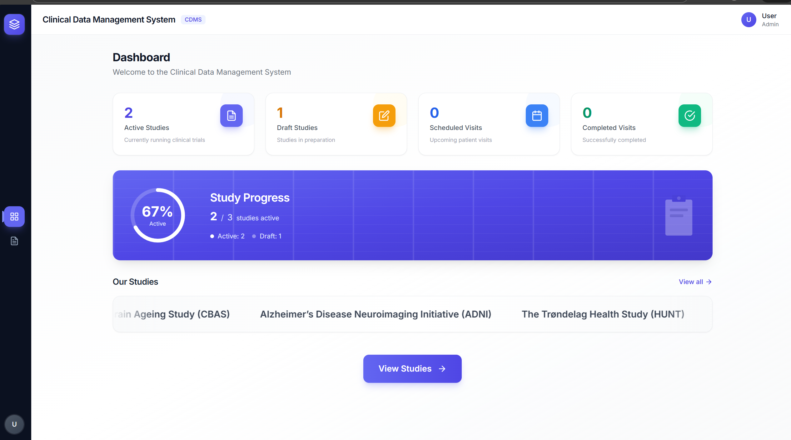
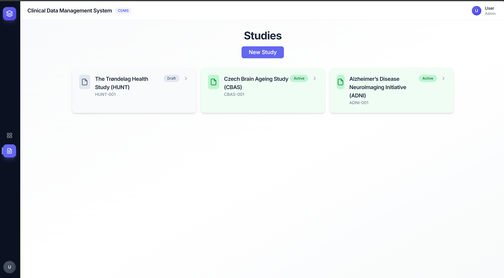
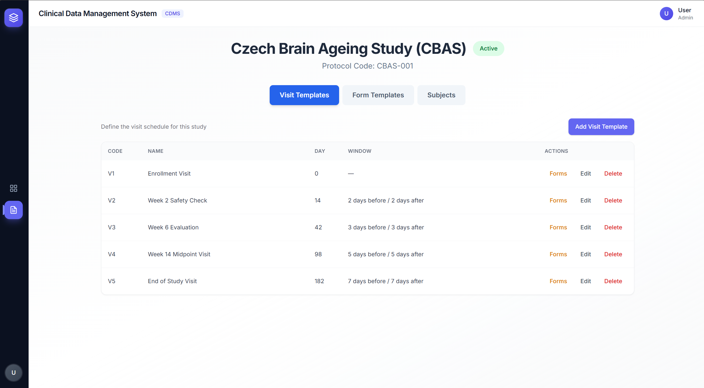
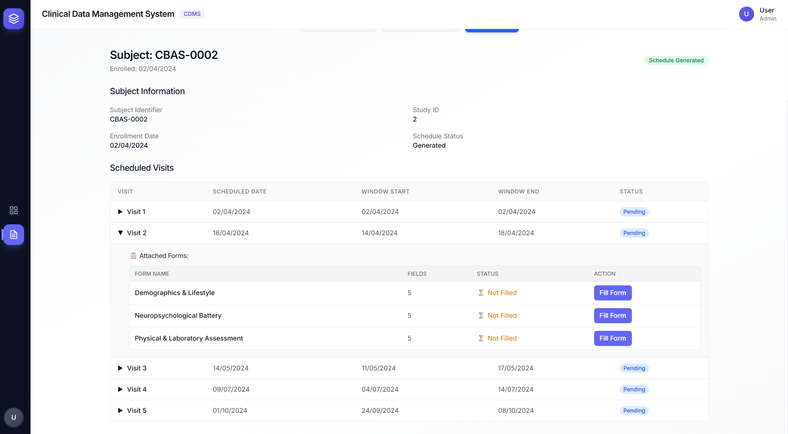
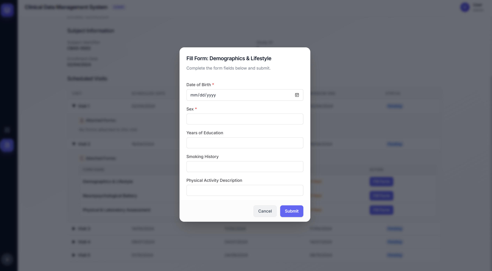
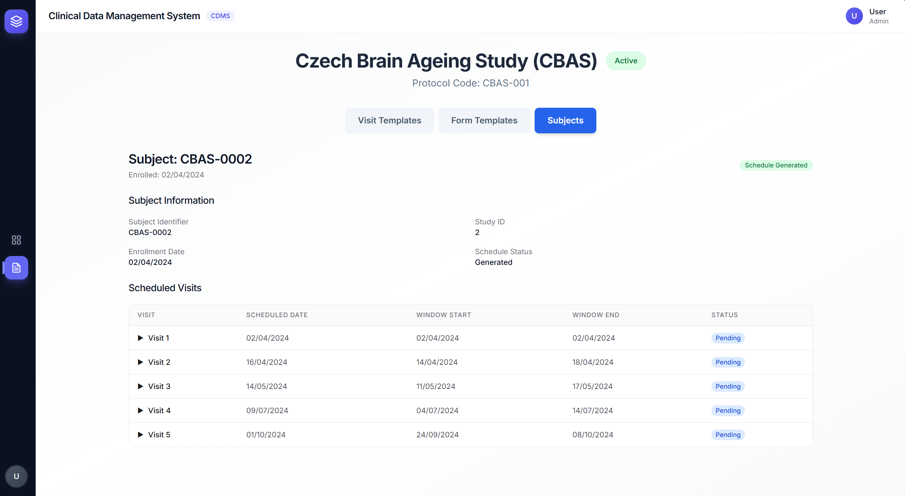
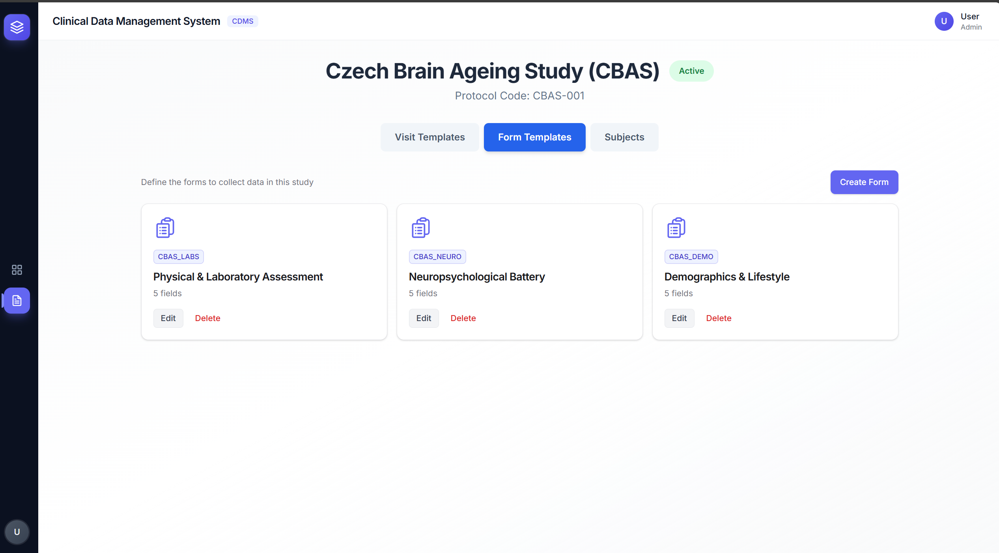
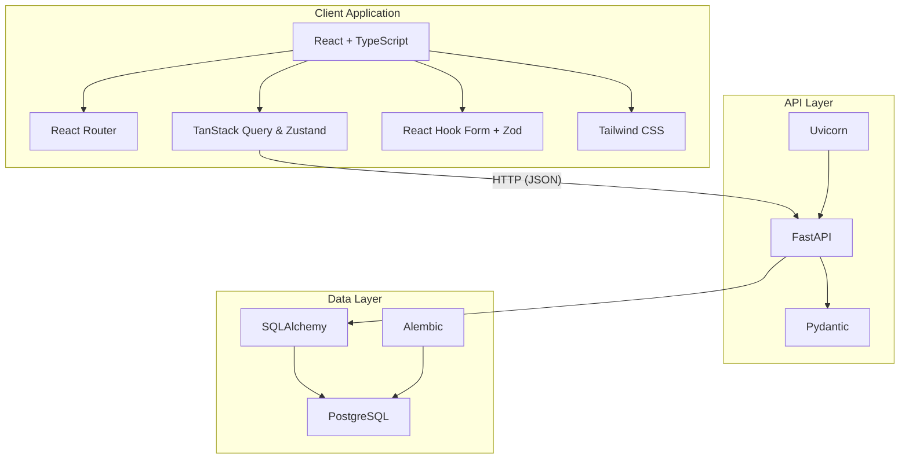
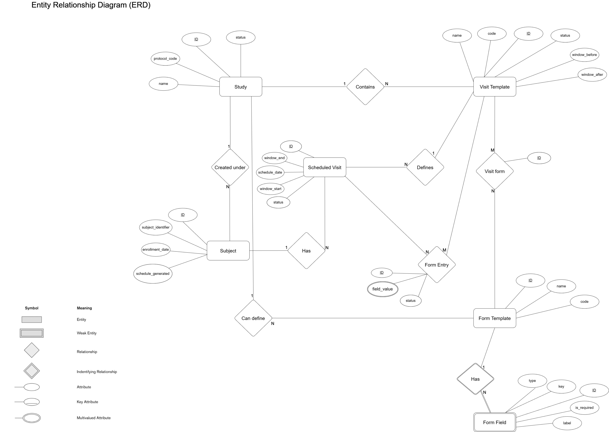

# CLINICAL DATA MANAGEMENT SYSTEM (CDMS)


A full-stack clinical data management platform designed to streamline the management of clinical trial data. The system provides dashboards, real-time analytics, and a robust backend API for managing studies, subjects, and visits.

### Screenshots

<p align="center">
    
    
    
</p>
<p align="center">
    
    
    
</p>
<p align="center">
    
</p>

---

## Quick Start

```bash
# 1. Clone the repository
git clone https://github.com/Mehdic01/Clinical-Data-Management-System-.git
cd Clinical-Data-Management-System-

# 2. (Optional) Configure backend environment
# If you want to run locally without Docker, copy the backend env example:
cp backend/.env.example backend/.env

# 3. Start the project using Docker
# Build and start the containers
docker compose up --build

# 4. Open the app
open--> http://localhost:5173
```

> **Note:** Ensure Docker and Docker Compose are installed on your system before running the above commands.

### Quick Start Notes (Helpful)

- **Windows PowerShell:** use `copy backend\.env.example backend\.env` instead of `cp` if you run locally without Docker.
- **Port conflicts:** If 5432/5173/8000 are busy, update [docker-compose.yml](docker-compose.yml) ports.
- **Clean reset (optional):** `docker compose down -v` then `docker compose up --build` to rebuild and reseed.

> **Note:** Ensure Docker and Docker Compose are installed on your system before running the above commands.

---

## Architecture

### System Architecture Overview

This project is implemented as a modern, full-stack **Clinical Data Management System** designed with scalability, maintainability, and clear separation of concerns in mind. The architecture integrates a Python-based API layer with a React-based client application, communicating through well-defined RESTful interfaces.

On the server side, the system is built using **FastAPI**, chosen for its high performance, native async support, and strong integration with modern Python tooling. The application runs on **Uvicorn**, enabling efficient handling of concurrent HTTP requests. Persistent data storage is provided by **PostgreSQL**, accessed through **SQLAlchemy 2.0**, which offers a declarative ORM model and explicit session management. Database schema evolution and version control are handled via **Alembic**, ensuring safe and traceable migrations across environments.

Data validation and serialization are enforced using **Pydantic**, guaranteeing strict schema conformity for all API inputs and outputs. Environment configuration and runtime settings are managed with **pydantic-settings** and **python-dotenv**, allowing the application to remain environment-agnostic. Backend reliability is supported through automated testing with **pytest**, **pytest-asyncio**, and **httpx**, enabling both synchronous and asynchronous API validation.

On the client side, the application is built with **React** and **TypeScript**, providing a strongly typed and component-driven user interface. **Vite** is used as the build tool to ensure fast development feedback and optimized production builds. Navigation and view composition are managed with **React Router**, supporting nested routing patterns.

Server-derived state, including data fetching, caching, and synchronization, is handled by **TanStack Query (React Query)**, ensuring consistent and predictable API interactions. Local and UI-specific state is managed using **Zustand**, selected for its minimal boilerplate and lightweight design. Form handling and client-side validation are implemented with **React Hook Form** and **Zod**, enabling schema-based validation aligned with backend data contracts.

HTTP communication is performed using **Axios**, which provides centralized request configuration and error handling. User notifications and feedback are delivered via **React Hot Toast**, offering a clean and non-intrusive messaging experience. Visual styling across the application is implemented using **Tailwind CSS**, enabling rapid UI development with a consistent design language.

Together, these technologies form a cohesive architecture where the backend focuses on data integrity, validation, and business logic, while the frontend delivers a responsive, maintainable, and scalable user experience.

---

### High-Level Component Interaction



### Data Model (Entity Relationship Diagram)

Below is the ER diagram representing the data model for this project:



---

### Project Files Structure

#### Backend (FastAPI)

```
backend/
├── app/                              # FastAPI application package
│   ├── main.py                       # App entrypoint, middleware, router registration
│   ├── core/                         # Configuration layer
│   │   └── config.py                 # Pydantic settings (.env)
│   ├── db/                           # Database session & base
│   │   ├── base.py                   # SQLAlchemy Base
│   │   └── session.py                # Engine + SessionLocal + get_db()
│   ├── models/                       # SQLAlchemy ORM models
│   │   ├── study.py
│   │   ├── subject.py
│   │   ├── visit_template.py
│   │   ├── form_template.py
│   │   ├── form_field.py
│   │   ├── visit_template_form.py
│   │   ├── scheduled_visit.py
│   │   ├── form_entry.py
│   │   └── field_value.py
│   ├── schemas/                      # Pydantic schemas (request/response)
│   │   ├── study.py
│   │   ├── subject.py
│   │   ├── visit_template.py
│   │   ├── form_templates.py
│   │   ├── visit_forms.py
│   │   └── form_entry.py
│   ├── routers/                      # API route modules by domain
│   │   ├── health.py
│   │   ├── studies_service.py
│   │   ├── visit_templates_service.py
│   │   ├── form_templates_service.py
│   │   ├── visit_forms_service.py
│   │   ├── scheduled_visit_service.py
│   │   ├── form_entry_service.py
│   │   ├── subject_service.py
│   │   └── dashboard_service.py
│   ├── seed.py                        # Seed script for initial data
│   └── tests/                          # Pytest suite
│       ├── conftest.py
│       ├── test_health.py
│       └── test_crud.py
├── alembic/                           # Alembic migrations
│   ├── env.py
│   └── versions/                      # Migration files
├── alembic.ini                         # Alembic config
├── requirements.txt                    # Python dependencies
├── pytest.ini                          # Pytest configuration
└── Dockerfile                          # Backend Dockerfile
```

#### Frontend (React + Vite)

This project uses a **feature-first architecture**. Each domain area (studies, subjects, visit-templates, etc.) lives in its own folder alongside its pages, components, and hooks. This approach keeps the codebase modular, enables parallel development, and makes feature-level maintenance and scaling easier.

```
frontend/
├── src/
│   ├── assets/                   # Static assets and icons
│   ├── api/                      # API layer
│   │   ├── axios.ts              # Axios instance & interceptors
│   │   ├── endpoints.ts          # API endpoint constants
│   │   └── services/
│   │       ├── study.service.ts
│   │       ├── visit-template.service.ts
│   │       ├── form-template.service.ts
│   │       ├── subject.service.ts
│   │       ├── scheduled-visit.service.ts
│   │       └── form-entry.service.ts
│   │
│   ├── components/               # Reusable components
│   │   ├── ui/                   # Base UI components (shadcn)
│   │   │   ├── button.tsx
│   │   │   ├── input.tsx
│   │   │   ├── select.tsx
│   │   │   ├── table.tsx
│   │   │   ├── card.tsx
│   │   │   ├── dialog.tsx
│   │   │   ├── badge.tsx
│   │   │   └── ...
│   │   │
│   │   ├── layout/               # Layout components
│   │   │   ├── MainLayout.tsx
│   │   │   ├── Sidebar.tsx
│   │   │   ├── Header.tsx
│   │   │   └── PageContainer.tsx
│   │   │
│   │   └── shared/               # Shared business components
│   │       ├── LoadingSpinner.tsx
│   │       ├── ErrorMessage.tsx
│   │       ├── EmptyState.tsx
│   │       ├── ConfirmDialog.tsx
│   │       ├── DataTable.tsx
│   │       └── StatusBadge.tsx
│   │
│   ├── features/                 # Feature-based modules
│   │   ├── dashboard/
│   │   │   ├── components/
│   │   │   ├── hooks/
│   │   │   └── pages/
│   │   ├── studies/
│   │   │   ├── components/
│   │   │   │   ├── StudyList.tsx
│   │   │   │   ├── StudyCard.tsx
│   │   │   │   ├── StudyForm.tsx
│   │   │   │   └── StudyStatusBadge.tsx
│   │   │   ├── hooks/
│   │   │   │   └── useStudies.ts
│   │   │   ├── pages/
│   │   │   │   ├── StudiesPage.tsx
│   │   │   │   └── StudyDetailPage.tsx
│   │   │   └── index.ts
│   │   │
│   │   ├── visit-templates/
│   │   │   ├── components/
│   │   │   │   ├── VisitTemplateList.tsx
│   │   │   │   ├── VisitTemplateForm.tsx
│   │   │   │   └── VisitWindowBadge.tsx
│   │   │   ├── hooks/
│   │   │   │   └── useVisitTemplates.ts
│   │   │   └── pages/
│   │   │       └── VisitTemplatesPage.tsx
│   │   │
│   │   ├── form-templates/
│   │   │   ├── components/
│   │   │   │   ├── FormTemplateList.tsx
│   │   │   │   ├── FormBuilder.tsx
│   │   │   │   ├── FieldEditor.tsx
│   │   │   │   └── FieldTypeSelect.tsx
│   │   │   ├── hooks/
│   │   │   │   └── useFormTemplates.ts
│   │   │   └── pages/
│   │   │       ├── FormTemplatesPage.tsx
│   │   │       └── FormBuilderPage.tsx
│   │   │
│   │   ├── subjects/
│   │   │   ├── components/
│   │   │   │   ├── SubjectList.tsx
│   │   │   │   ├── SubjectForm.tsx
│   │   │   │   └── SubjectSchedule.tsx
│   │   │   ├── hooks/
│   │   │   │   └── useSubjects.ts
│   │   │   └── pages/
│   │   │       ├── SubjectsPage.tsx
│   │   │       └── SubjectDetailPage.tsx
│   │   │
│   │   └── form-entry/
│   │       ├── components/
│   │       │   ├── DynamicForm.tsx
│   │       │   ├── FieldRenderer.tsx
│   │       │   ├── FormEntryView.tsx
│   │       │   └── ScheduledVisitCard.tsx
│   │       ├── hooks/
│   │       │   └── useFormEntry.ts
│   │       └── pages/
│   │           └── FormEntryPage.tsx
│   │
│   ├── hooks/                    # Global custom hooks
│   │   ├── useDebounce.ts
│   │   ├── useLocalStorage.ts
│   │   └── useMediaQuery.ts
│   │
│   ├── lib/                      # Utilities & helpers
│   │   ├── utils.ts              # General utilities (cn, formatDate, etc.)
│   │   ├── validation.ts         # Zod schemas
│   │   └── constants.ts          # App-wide constants
│   │
│   ├── routes/                   # Routing configuration
│   │   ├── index.tsx             # Route definitions
│   │   └── ProtectedRoute.tsx    # Route guards (if needed)
│   │
│   ├── stores/                   # Zustand stores (client state)
│   │   ├── ui.store.ts           # UI state (sidebar, modals)
│   │   └── app.store.ts          # App-wide state
│   │
│   ├── types/                    # TypeScript types/interfaces
│   │   ├── study.types.ts
│   │   ├── visit-template.types.ts
│   │   ├── form-template.types.ts
│   │   ├── subject.types.ts
│   │   ├── scheduled-visit.types.ts
│   │   ├── form-entry.types.ts
│   │   └── api.types.ts          # Generic API response types
│   │
│   ├── App.tsx                   # App entry point
│   ├── main.tsx                  # Vite entry
│   └── index.css                 # Global styles (Tailwind)
```

---

## API Reference

All endpoints are defined under backend routers.

### Health
| Method | Path | Description |
|--------|------|-------------|
| GET | `/health` | Health check |

### Studies
| Method | Path | Description |
|--------|------|-------------|
| POST | `/studies` | Create a new study |
| GET | `/studies` | List all studies |
| GET | `/studies/{study_id}` | Get a study by ID |
| PUT | `/studies/{study_id}/activate` | Activate a study |

### Visit Templates
| Method | Path | Description |
|--------|------|-------------|
| POST | `/studies/{study_id}/visit-templates` | Create a visit template |
| GET | `/studies/{study_id}/visit-templates` | List visit templates for a study |
| PUT | `/studies/{study_id}/visit-templates/{visit_template_id}` | Update a visit template |
| DELETE | `/studies/{study_id}/visit-templates/{visit_template_id}` | Delete a visit template |

### Form Templates
| Method | Path | Description |
|--------|------|-------------|
| POST | `/studies/{study_id}/form-templates` | Create a form template (with fields) |
| GET | `/studies/{study_id}/form-templates` | List form templates for a study |
| GET | `/studies/{study_id}/form-templates/{form_template_id}` | Get a form template detail |
| GET | `/studies/{study_id}/form-templates/{form_template_id}/field-count` | Get field count for a form template |
| PUT | `/studies/{study_id}/form-templates/{form_template_id}` | Update a form template |
| DELETE | `/studies/{study_id}/form-templates/{form_template_id}` | Delete a form template |
| POST | `/studies/{study_id}/form-templates/{form_template_id}/fields` | Add a field to a form template |

### Visit Template Forms
| Method | Path | Description |
|--------|------|-------------|
| GET | `/studies/{study_id}/visit-templates/{visit_template_id}` | Get visit template with attached forms |
| GET | `/studies/{study_id}/form-templates` | List form templates for a study (attach forms) |
| PUT | `/studies/{study_id}/visit-templates/{visit_template_id}/attached-forms` | Replace attached forms for a visit template |

### Subjects
| Method | Path | Description |
|--------|------|-------------|
| GET | `/studies/{study_id}/subjects` | List subjects for a study |
| POST | `/studies/{study_id}/subjects` | Create a subject |
| GET | `/subjects/{subject_id}` | Get subject detail (with scheduled visits) |
| DELETE | `/subjects/{subject_id}` | Delete a subject |

### Scheduled Visits
| Method | Path | Description |
|--------|------|-------------|
| POST | `/subjects/{subject_id}/scheduled-visits` | Generate scheduled visits for a subject |

### Form Entries
| Method | Path | Description |
|--------|------|-------------|
| GET | `/scheduled-visits/{scheduled_visit_id}/forms` | List forms for a scheduled visit |
| GET | `/form-entries/{form_entry_id}` | Get form entry detail |
| POST | `/scheduled-visits/{scheduled_visit_id}/form-entries` | Create a form entry |

### Dashboard
| Method | Path | Description |
|--------|------|-------------|
| GET | `/dashboard/summary` | Dashboard summary metrics |

---

## Trade-offs and Possible Improvements

### Trade-offs
- **Monolith API vs. service split:** The backend is a single FastAPI app for simplicity, which keeps deployment easy but limits independent scaling of modules.
- **Sync SQLAlchemy sessions:** Synchronous ORM keeps code straightforward, but async DB access could improve throughput under high load.
- **Minimal RBAC:** Permissions are kept simple for the assignment scope; more granular role-based policies would increase complexity.
- **Single DB instance:** A single PostgreSQL instance simplifies operations but can be a bottleneck for very large datasets.

### Possible Improvements
- **Async DB layer:** Migrate to SQLAlchemy async + async driver for better concurrency.
- **Authentication/RBAC:** Add JWT auth with refresh tokens and fine‑grained permissions if needed.
- **Observability:** Add structured logging, request tracing, and metrics (e.g., OpenTelemetry + Prometheus).
- **Caching:** Add Redis for hot endpoints such as dashboard summary.
- **CI/CD:** Add automated linting, tests, and Docker image builds in CI.
- **E2E tests:** Add frontend E2E coverage (Playwright/Cypress) for critical flows.
- **API docs:** Publish OpenAPI docs and examples per endpoint for easier onboarding.

---

## Tech Stack:

| Layer | Technology |
|-------|-----------|
| Frontend | React 19, Vite, TypeScript, Tailwind CSS 4, TanStack Query (React Query), React Router v6, React Hook Form + Zod, Zustand, Axios |
| Backend | FastAPI, Python 3.12, SQLAlchemy 2.0, Alembic, Pydantic v2, psycopg |
| Database | PostgreSQL 16|
| Deployment | Docker Compose (3 services)|
| Testing | pytest (31 tests), pytest-asyncio, httpx|

---

## Development

### Backend

```bash
cd backend
pip install -r requirements.txt
alembic upgrade head
uvicorn app.main:app --reload --port 8000
```

### Frontend

```bash
cd frontend
npm install
npm run dev
```

## Testing

#### Backend (pytest) — 31 tests

```bash
cd backend
pytest -v
```

| Module | Tests | Coverage |
|--------|-------|----------|
| `test_health.py` | 5 | Health check, DB connectivity, tables, FKs |
| `test_crud.py` | 26 | CRUD endpoints for studies, visits, forms, subjects |

---

## Seed Data

This project includes a seed script at [backend/app/seed.py](backend/app/seed.py) to populate initial demo data for testing.

- **Docker behavior:** When you run `docker compose up --build`, the `seed` service executes automatically after the database is healthy and the backend is started. It runs Alembic migrations and then seeds the database.
- **Idempotent:** The seed script checks if the data already exists and skips re-inserting to avoid duplicates.

If you ever want to run it manually (outside Docker), you can execute:

```bash
cd backend
python -m app.seed
```
## Docker Operations and Service Overview

This project runs via [docker-compose.yml](docker-compose.yml) with three core services and a seed process. Below is a professional summary of Docker operations and each service’s responsibilities.


### Service Roles and Responsibilities

#### Frontend (React + Vite)
- **Service name:** `frontend`
- **Purpose:** Serves the user interface and communicates with the backend via API.
- **Port:** `5173` (host) → `5173` (container)
- **Important note:** `VITE_API_BASE_URL` is set to `http://localhost:8000` for browser access.

#### Backend (FastAPI + Uvicorn)
- **Service name:** `backend`
- **Purpose:** Exposes REST APIs, enforces business logic, and communicates with the DB through SQLAlchemy.
- **Port:** `8000` (host) → `8000` (container)
- **Startup step:** Automatically runs Alembic migrations inside the container, then starts Uvicorn.

#### Database (PostgreSQL 16)
- **Service name:** `db`
- **Purpose:** Provides the persistent database layer for the application.
- **Port:** `5432` (host) → `5432` (container)
- **Data persistence:** Uses the `gqa_pgdata` volume to retain data across restarts.
- **Healthcheck:** Backend and seed processes do not start until the DB is healthy.

#### Seed (Data Seeding)
- **Service name:** `seed`
- **Purpose:** Creates initial demo data and required table structures.
- **Behavior:** Runs once after the DB is healthy and the backend is started, then exits (no restart).

### Dependency Flow (Summary)

- `backend` starts only after `db` is healthy.
- `seed` runs once after `backend` has started.
- `frontend` performs API calls once `backend` is available.

This setup is optimized for easy onboarding, environment consistency, and repeatable deployments.


