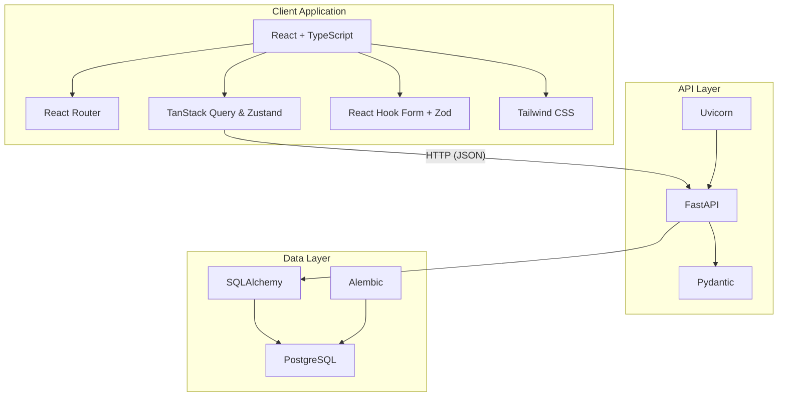

# CLINICAL DATA MANAGEMENT SYSTEM (CDMS)


A full-stack clinical data management platform designed to streamline the management of clinical trial data. The system provides dashboards, real-time analytics, and a robust backend API for managing studies, subjects, and visits.

---

## how to run the project

```bash
# 1. Clone the repository
git clone <repository-url>
cd gqa-assignment

# 2. Configure environment
cp .env.example .env
# Edit .env to set up database credentials and other configurations

# 3. Start the project using Docker
# Build and start the containers
docker-compose up --build

# 4. Open the app
# Frontend: http://localhost:5173
# Backend API: http://localhost:8000/docs
```

> **Note:** Ensure Docker and Docker Compose are installed on your system before running the above commands.

---

## Architecture

### System Architecture Overview

This project is implemented as a modern, full-stack **Clinical Data Management System** designed with scalability, maintainability, and clear separation of concerns in mind. The architecture integrates a Python-based API layer with a React-based client application, communicating through well-defined RESTful interfaces.

On the server side, the system is built using **FastAPI**, chosen for its high performance, native async support, and strong integration with modern Python tooling. The application runs on **Uvicorn**, enabling efficient handling of concurrent HTTP requests. Persistent data storage is provided by **PostgreSQL**, accessed through **SQLAlchemy 2.0**, which offers a declarative ORM model and explicit session management. Database schema evolution and version control are handled via **Alembic**, ensuring safe and traceable migrations across environments.

Data validation and serialization are enforced using **Pydantic**, guaranteeing strict schema conformity for all API inputs and outputs. Environment configuration and runtime settings are managed with **pydantic-settings** and **python-dotenv**, allowing the application to remain environment-agnostic. Backend reliability is supported through automated testing with **pytest**, **pytest-asyncio**, and **httpx**, enabling both synchronous and asynchronous API validation.

On the client side, the application is built with **React** and **TypeScript**, providing a strongly typed and component-driven user interface. **Vite** is used as the build tool to ensure fast development feedback and optimized production builds. Navigation and view composition are managed with **React Router**, supporting nested routing patterns.

Server-derived state, including data fetching, caching, and synchronization, is handled by **TanStack Query (React Query)**, ensuring consistent and predictable API interactions. Local and UI-specific state is managed using **Zustand**, selected for its minimal boilerplate and lightweight design. Form handling and client-side validation are implemented with **React Hook Form** and **Zod**, enabling schema-based validation aligned with backend data contracts.

HTTP communication is performed using **Axios**, which provides centralized request configuration and error handling. User notifications and feedback are delivered via **React Hot Toast**, offering a clean and non-intrusive messaging experience. Visual styling across the application is implemented using **Tailwind CSS**, enabling rapid UI development with a consistent design language.

Together, these technologies form a cohesive architecture where the backend focuses on data integrity, validation, and business logic, while the frontend delivers a responsive, maintainable, and scalable user experience.

---

### High-Level Component Interaction



### Data Model (Entity Relationship Diagram)

Below is the ER diagram representing the data model for this project:


---

## Environment Variables

| Variable           | Description                | Default         |
|--------------------|----------------------------|-----------------|
| `DATABASE_URL`     | PostgreSQL connection URL  | `postgresql://` |
| `PGPORT`           | PostgreSQL port            | `5432`          |
| `POSTGRES_USER`    | Database username          | `user`          |
| `POSTGRES_PASSWORD`| Database password          | `password`      |
| `POSTGRES_DB`      | Database name              | `gqa_db`        |
| `API_PORT`         | Backend API port           | `8000`          |

---

## Development

### Backend

```bash
cd backend
pip install -r requirements.txt
alembic upgrade head
uvicorn app.main:app --reload --port 8000
```

### Frontend

```bash
cd frontend
npm install
npm run dev
```

### Run Tests

#### Backend Tests
```bash
cd backend
pytest
```

#### Frontend Tests
```bash
cd frontend
npm run test
```

---

## Project Structure

```
gqa-assignment/
├── backend/                # Backend service
│   ├── app/                # FastAPI application
│   ├── alembic/            # Database migrations
│   ├── requirements.txt    # Python dependencies
│   └── Dockerfile          # Backend Dockerfile
├── frontend/               # Frontend service
│   ├── src/                # React application source
│   ├── package.json        # Frontend dependencies
│   └── Dockerfile          # Frontend Dockerfile
└── docker-compose.yml      # Multi-service orchestration
```

---

## License

This project is licensed under the MIT License. See the LICENSE file for details.